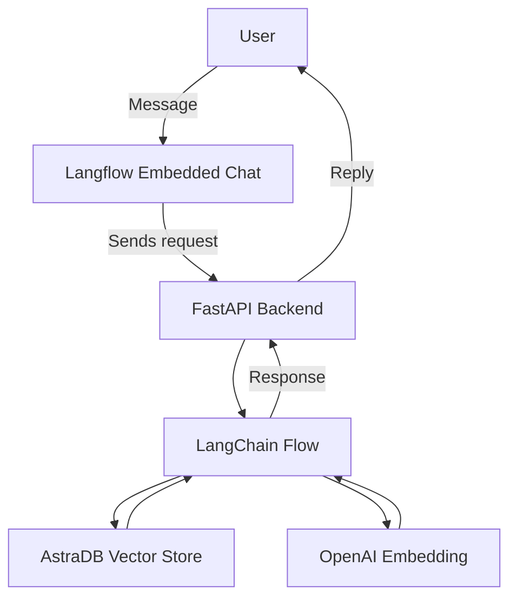

# 🧠 Employee Application Bot 
Link: https://employeeappbot.onrender.com/

This project is a conversational AI chatbot for employee-related queries, built using **FastAPI**, **LangChain**, and **AstraDB**. It integrates vector-based retrieval and OpenAI-powered language models to understand and respond to natural language input.

---

## 🚀 Features

- 🔥 FastAPI REST backend
- 🧠 LangChain-based conversation engine
- 🗃️ AstraDB vector store with OpenAI embeddings
- 📄 SplitText for parsing and chunking documents
- 🧾 Fully embeddable UI using Langflow
- ⚙️ Supports employee data queries via natural language

---

## 🧩 Architecture Overview


---
## 🛠️ Project Structure
``` bash
Employee_Application/
├── app.py                 # FastAPI application
├── database.sql           # SQL schema for user and blog tables
├── readme.md              # Complete documentation
├── .env                   # Sensitive config (excluded from git)
├── /models                # Optional: Pydantic models
├── /langchain_flow        # LangChain integration
└── /static                
```
---

## 🛠️ The ENV Structure

```env
OPENAI_API_KEY=sk-...
ASTRA_DB_ID=your-astra-db-id
ASTRA_DB_APPLICATION_TOKEN=your-astra-token
ASTRA_DB_REGION=us-east-2
ASTRA_DB_KEYSPACE=default_keyspace
```
---

## 🛠️ Technologies Used

### ⚙️ Backend Frameworks & APIs

| Technology    | Purpose                                                  |
|---------------|-----------------------------------------------------------|
| **FastAPI**   | High-performance API framework for building web services |
| **Uvicorn**   | ASGI server to run the FastAPI app                        |
| **LangChain** | Framework for LLM chaining, embedding, and memory        |
| **OpenAI API**| For generating and embedding natural language responses  |

---

### 🧠 AI & Embedding Tools

| Technology              | Purpose                                                |
|-------------------------|--------------------------------------------------------|
| **OpenAIEmbeddings**    | Converts user input into vector embeddings             |
| **SplitText**           | Breaks text into chunks before embedding               |
| **AstraDB (Vector Store)** | Stores embeddings and performs similarity search   |

---

### 🗃️ Database & Data Access

| Technology            | Purpose                                         |
|------------------------|-------------------------------------------------|
| **AstraDB (Cassandra)**| Scalable vector database for embeddings        |
| **cassandra-driver**   | Python SDK to connect to AstraDB               |

---

### 🔐 Configuration & Environment

| Technology        | Purpose                                             |
|-------------------|-----------------------------------------------------|
| **python-dotenv** | Loads environment variables from a `.env` file      |
| **.env file**     | Stores API keys and secrets securely                |

---

### 🧪 Development Tools

| Technology   | Purpose                                             |
|--------------|-----------------------------------------------------|
| **pydantic** | Data validation and typing for FastAPI models       |
| **typing**   | Python static type hints                            |
| **logging**  | Console/debug output tracking                       |

---

### 💬 Optional Frontend

| Technology               | Purpose                                                  |
|--------------------------|----------------------------------------------------------|
| **Langflow Chat Widget** | Embeds the bot using a script on HTML pages              |
| **HTML / JavaScript**    | Used to mount the chat interface (optional)              |

